# Python Plotting Tools

This repository provides a python code to generate figures (e.g., curves and barcharts) that can be used in the paper to show the results.

Dependencies: Python 3.+, numpy, and matplotlib.

## Table of Contents
* [Preliminary](#preliminary)
  + [Layout of the diagram](#layout-of-the-diagram)
  + [Sample configuration file](#sample-configuration-file)
* [Examples for Plotting Curves](#examples-for-plotting-curves)
  + [Plot simple curves](#plot-simple-curves)
  + [Plot dots](#plot-dots)
  + [Plot figure with customized xticklabel](#plot-figure-with-customized-xticklabel)
  + [Plot figure with two different Y-axes](#plot-figure-with-two-different-y-axes)
  + [Plot figure with customized legends](#plot-figure-with-customized-legends)
* [Examples for Plot Functions](#examples-for-plot-functions)
* [Examples for Plotting Barchart](#examples-for-plotting-barchart)
  + [Layout of the barchart](#layout-of-the-barchart)
  + [Plot barchart with customized yticklabel](#plot-barchart-with-customized-yticklabel)
  + [Plot barchart with four bars in each group](#plot-barchart-with-four-bars-in-each-group)
* [Create Colorbar](#create-colorbar)
* [Crop Patches for Zoom-in Comparison](#crop-patches-for-zoom-in-comparison)

## Preliminary
### Layout of the diagram
The following shows a simple but complete diagram.
<p align="center">
    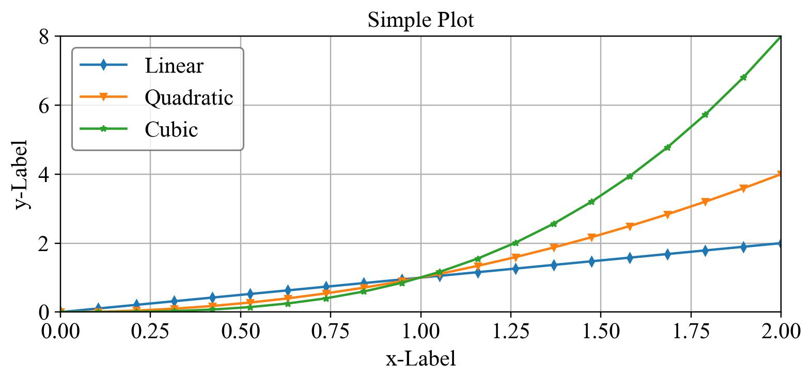
</p>

It contains the following common components. When creating a new diagram, we will modify these components to present our data: 
- Title
- X-Label, xtick, and, xticklabel
- Y-Label, ytick, and, yticklabel
- Line, Marker, Legend
- Grid

<p align="center">
    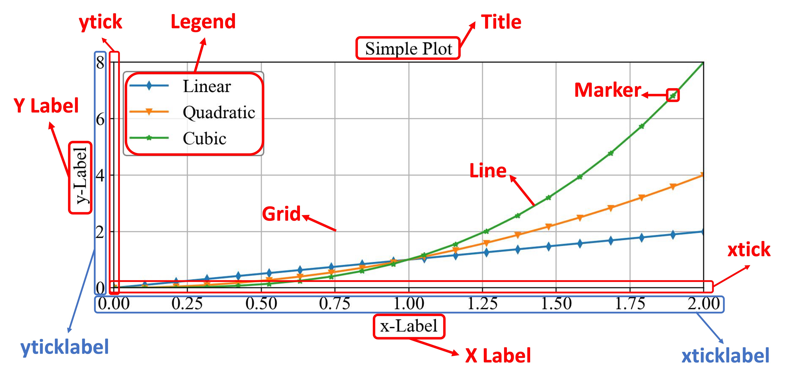
</p>

### Sample configuration file
In this code, we define the appearance of the diagram with a configuration file.
Then, we can plot the diagram by simply running:
```shell
python plot_diagram.py examples/demo/simple_plot.conf
```
The configuration file for the above simple plot is shown below with comments.

```shell
# CONFIGURATION FILE

# Comments start with '#'; 
# Parameters start with '!';
# If a parameter contains space, please replace the space with '&' for correct parsing
# For bool type, 1 is True else False

# Plot type: ploty|plotxy|plottwins
# ploty: The input data only contains Y values, the X values are generated as [0, ..., len(Y)]
# plotxy: The input data contains both X and Y values
# plottwins: The input data only contains Y values. Plot figure with two different Y-axis
! plot_type plotxy

# Figure format: pdf|jpg|png
! format pdf

# Canvas setting, fig size in inches
# https://matplotlib.org/devdocs/gallery/subplots_axes_and_figures/figure_size_units.html
! width 7
! height 3
! dpi 220

# Line and marker setting, different lines have different colors and marker shapes
# https://matplotlib.org/stable/api/_as_gen/matplotlib.pyplot.plot.html
# Example colors: 'r', 'k', 'b', 'g', 'y', 'm', 'c', 'tab:blue', 'tab:orange'
# Example markers: 'd', 'v', '1', '8', 'o', '^', '<', '>', 's', '*', 'p' 
! linewidth 1.5
! line_style -
! color tab:blue tab:orange tab:green
! markersize 4
! marker d v *

# Title and label setting 
# None indicates ignore; '&' is a placeholder for space;
# Eample font sizes: 'x-small', 'small', 'medium', 'large', 'x-large', 'xx-large', 'larger', 'smaller'
! title Simple&Plot
! title_font x-large
! xlabel x-Label
! xlabel_font x-large
! ylabel y-Label
! ylabel_font x-large

# Legend setting
# https://matplotlib.org/stable/api/_as_gen/matplotlib.pyplot.legend.html
# Example legend loc: 'best', 'upper left', 'upper right', 'lower left', 'lower right'
! legend Linear Quadratic Cubic
! legend_loc upper&left
! legend_font x-large
! legend_ncol 1

# Set grid on or off, 1 for on, 0 for off
! grid_on 1

# Data configuration
# Store the data values of a curve in a file, e.g., data.txt
# If have multiple curves, just list the file names one by one
! datafile data/linear.txt data/quadratic.txt data/cubic.txt

# Specify the maximum number of points, 
! max_point_num 1000

# set whether sort the data (None|ascend|descend), all x values should be the same for different curves
! sort_data None
```

## Examples for Plotting Curves

### Plot simple curves
The main difference between the following three configuration files is the number of curves.
```shell
# Figure at the below left
python plot_diagram.py examples/curve_simple_example/ploty_single_curve.conf

# Figure at the below middle
python plot_diagram.py examples/curve_simple_example/ploty_two_curves.conf

# Figure at the below right
python plot_diagram.py examples/curve_simple_example/ploty_multi_curves.conf
```

<p align="center">
    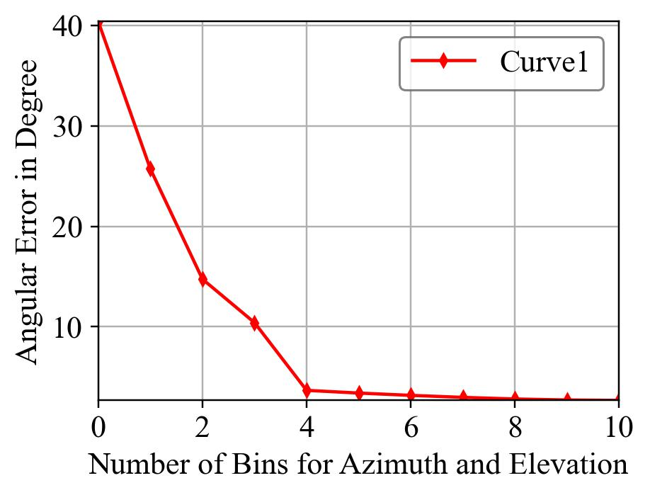
    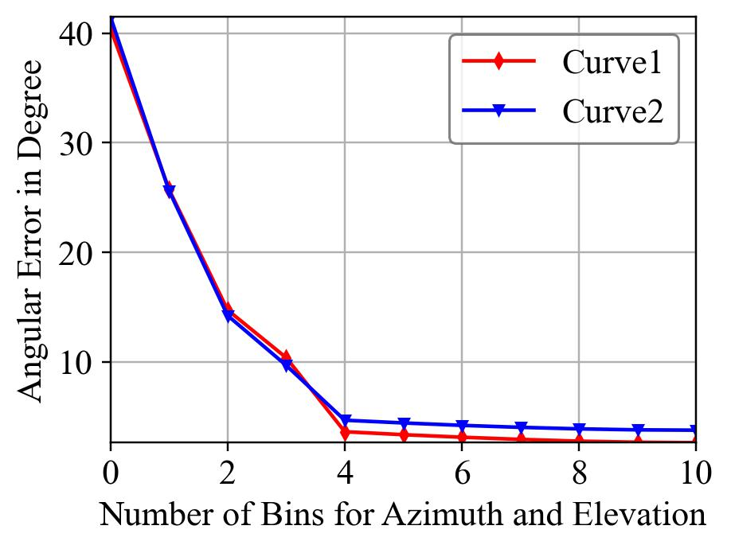
    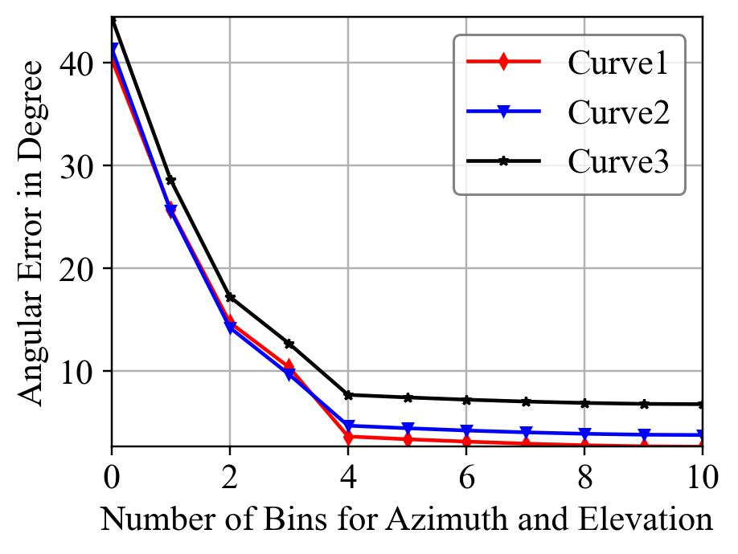
</p>

### Plot dots
By adding  "`! draw_dot 1`" in the `.conf`, we can plot dots instead of lines.
```shell
python plot_diagram.py examples/curve_simple_example/ploty_multi_dots.conf
```
<p align="center">
    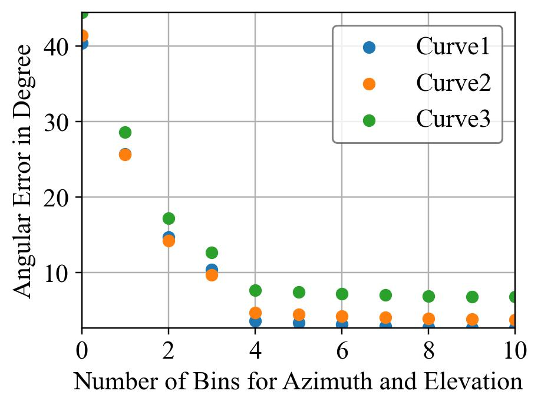
</p>

### Plot figure with customized xticklabel
We can manually set the xticklabel in the configuration file. e.g., adding "`! xticklabel 2 4 9 18 30 36 45 60 90 180 $\infty$`". 
```shell
python plot_diagram.py examples/curve_custom_xtick/ploty_set_xtick.conf
```
<p align="center">
    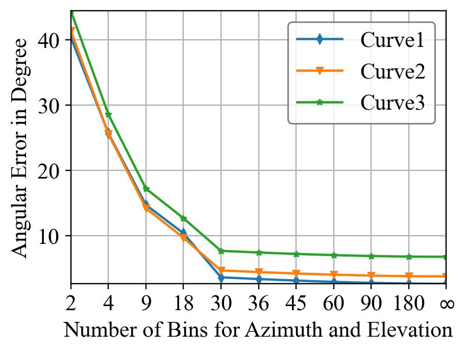
</p>

We can also load the xticklabel from a file by setting the path, e.g., adding "`! xtick_path data/merl_name.txt`". We can rotate the xticklabel if they are too long by adding "`! xtick_rot 90`".

```shell
python plot_diagram.py examples/curve_custom_xtick/ploty_set_rotate_xtick.conf
# Remember that we can plot dots by setting draw_dot to 1 in the configuration file
```

<p align="center">
    
    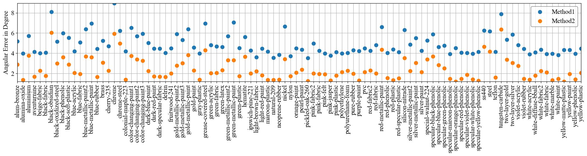
</p>

### Plot figure with two different Y-axes
By setting the `plot_type` to `plottwins`, we can draw the figure with two different Y-axes. But remember that this current implementation only supports two curves, one for each Y-axis.
```shell
python plot_diagram.py examples/curve_twin_y_axis/plottwins_yaxis.conf
```
<p align="center">
    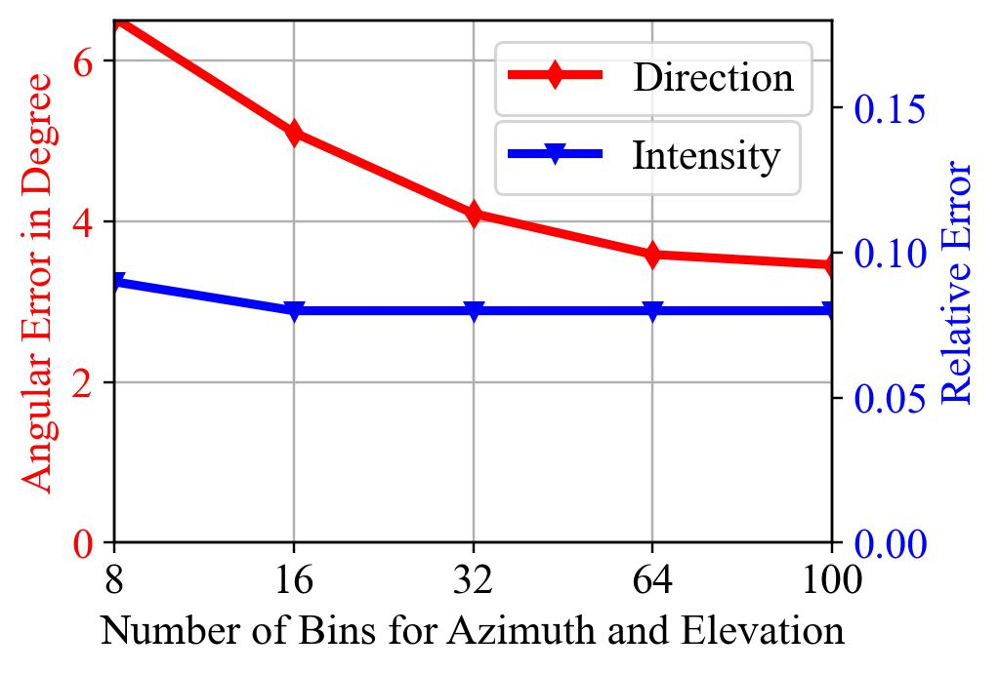
</p>

### Plot figure with customized legends
Note that this example is a hardcode for this specific legend pattern (i.e., two curves share the same legend).
```shell
python plot_diagram.py examples/curve_custom_legend/ploty_custom_legend.conf
```
<p align="center">
    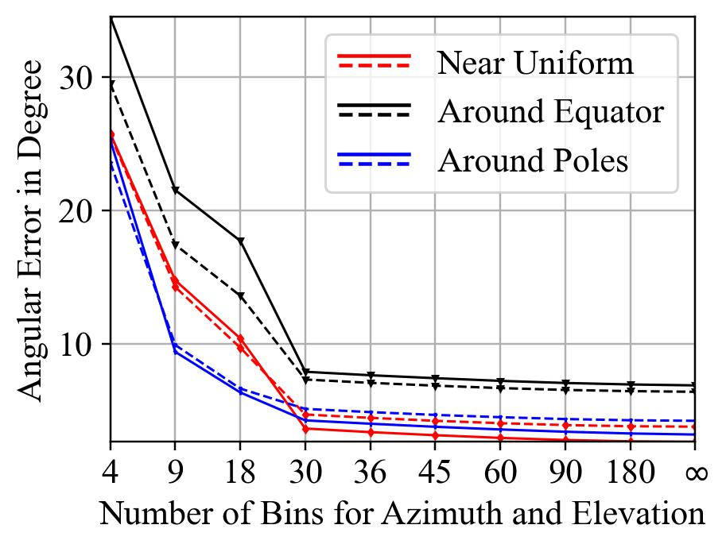
</p>

## Examples for Plot Functions
TODO.

## Examples for Plotting Barchart
### Layout of the barchart
The following shows a simple barchart.
<p align="center">
    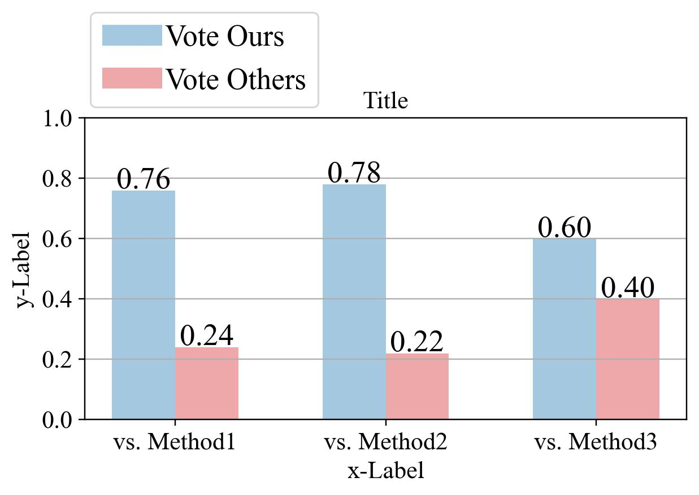 <br>
</p>

It contains the following common components. When creating a new barchart, we will modify these components to present our data: 
- Title
- X-Label, xtick, and, xticklabel
- Y-Label, ytick, and, yticklabel
- Bar, Text, Legend
- Grid
<p align="center">
    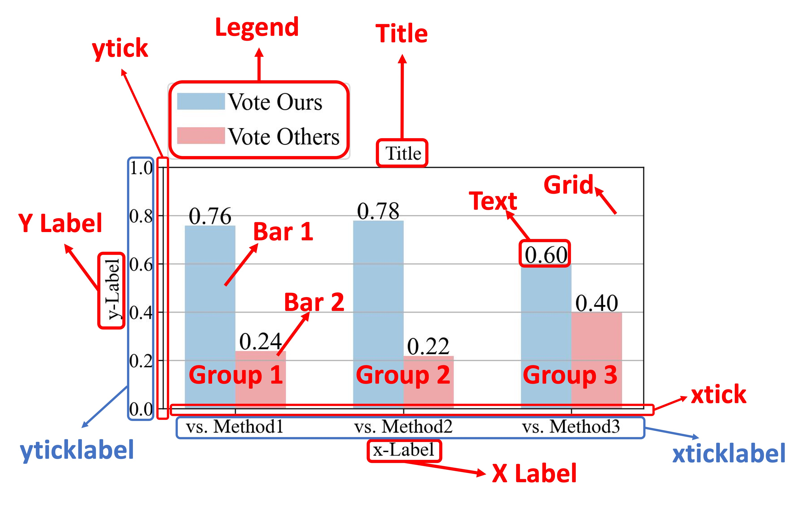
</p>

The above barchart can be generated by running:
```shell
python plot_diagram.py examples/barchart_example1/simple_barchart.conf
```

<details>
    <summary>Configuration file for the above barchart</summary>

```shell
# CONFIGURATION FILE

# Comments start with '#'; 
# Parameters start with '!';
# If a parameter contains space, please replace the space with '&' for correct parsing
# For bool type, 1 is True else False

# Plot type: ploty|plotxy|plottwins
# ploty: The input data only contains Y values, the X values are generated as [0, ..., len(Y)]
# plotxy: The input data contains both X and Y values
# plottwins: The input data only contains Y values. Plot figure with two different Y-axis
    ! plot_type plotbar

# Figure format: pdf|jpg|png
    ! format pdf

# Canvas setting, fig size in inches
# https://matplotlib.org/devdocs/gallery/subplots_axes_and_figures/figure_size_units.html
    ! width 5.5
    ! height 3
    ! dpi 220

# Data configuration
# Store the data values of the barchart in a single file, e.g., data.txt
# Each column corresponds to a group
# The number of row equals to the number of bars in a group 
    ! datafile data/bar_data_3group.txt

# IMPORTANT: Please remember to update the color, legend, xticklabel to match the input

# Bar setting
# Opacity sets the transparency of the bar, 0 indicates solid color
# Number of color and Opacity should equal to the bar numbers
    ! bar_width 0.3
    ! color tab:blue tab:red
    ! opacity 0.4 0.4
    ! y_min 0
    ! y_max 1

# xtick and ytick setting
    ! xticklabel vs.&Method1 vs.&Method2 vs.&Method3
# ! ytick 0 0.2 0.4 0.6 0.8 1.0
# ! yticklabel 0 20% 40% 60% 80% 100%

# Text setting
    ! put_text 1
    ! text_font 18
    ! percentage 0

# Title and label setting 
# None indicates ignore; '&' is a placeholder for space;
# Eample font sizes: 'x-small', 'small', 'medium', 'large', 'x-large', 'xx-large', 'larger', 'smaller'
    ! title Title
    ! title_font x-large
    ! xlabel x-Label
    ! xlabel_font x-large
    ! ylabel y-Label
    ! ylabel_font x-large

# Legend setting
# https://matplotlib.org/stable/api/_as_gen/matplotlib.pyplot.legend.html
# Example legend loc: 'best', 'upper left', 'upper right', 'lower left', 'lower right'
    ! legend Vote&Ours Vote&Others
    ! legend_loc upper&left
    ! legend_font xx-large
    ! legend_ncol 1
# You might need to tune the following bbox_to_anchor parameters to manually place the legends
    ! bbox_to_anchor -0.015 1.40

# Set grid on or off, 1 for on, 0 for off
    ! grid_on 1
```
</details>

### Plot barchart with customized yticklabel
```shell
python plot_diagram.py examples/barchart_example1/simple_barchart_custom_ytick.conf
```
We set yticklabel in percentage, legend column number to 2, and show text in percentage, by adding the following to the config file.
```
! ytick 0 0.2 0.4 0.6 0.8 1.0
! yticklabel 0 20% 40% 60% 80% 100%
! legend_ncol 2
! percentage 1
```
<p align="center">
    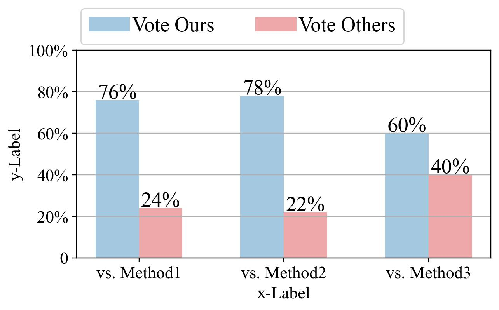
</p>

### Plot barchart with four bars in each group
```shell
python plot_diagram.py examples/barchart_example2/barchart_color.conf
```
<p align="center">
    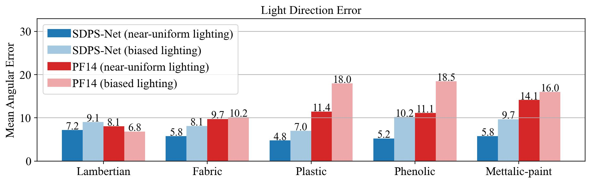
</p>

## Create Colorbar
We also provide a simple script to generate colorbar.
```shell
python img_tools/color_bar.py --colormap jet
python img_tools/color_bar.py --colormap jet --horizontal
python img_tools/color_bar.py --colormap viridis
python img_tools/color_bar.py --colormap viridis --horizontal
```
<p align="center">
    
    
    
    
</p>

## Crop Patches for Zoom-in Comparison
As it is very common to show zoom-in comparison between different methods in the paper, we provide a small image cropping scripts for this task.
<p align="center">
     &emsp;
     &emsp;
    
</p>

By specifying the directory storing images, the desired box locations, and the colors, the following command can crop and highlight the boxes in the original images. However, you have to determine the locations of the boxes [left top bottom right] using other softwares.
```shell
python img_tools/image_cropper.py --in_dir examples/image_cropper_example/ -k '*.jpg' \
    --save_dir ROI --save_ext .jpg \
    --boxes 118 60 193 150 --boxes 371 452 431 521 --colors r g
# bash scripts/image_cropping.sh 
```
<p align="center">
    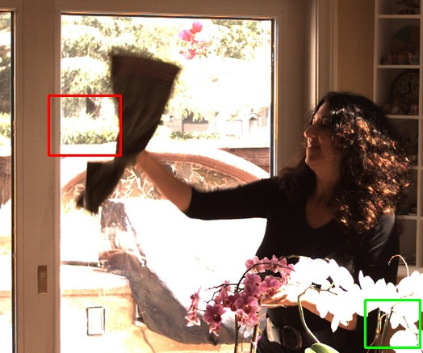 &emsp;
     &emsp;
    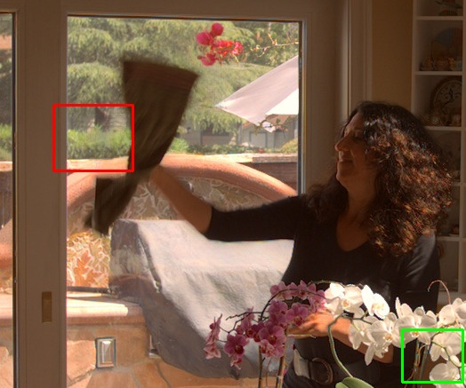
    <br>
    
     &emsp;
    
     &emsp;
    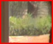
    
</p>

We can also add arrows onto the images to further highlight the differences.
```shell
python img_tools/image_cropper.py --in_dir examples/image_cropper_example/ --key '*.jpg' \
    --save_dir ROI_arrow --save_ext .jpg \
    --boxes 118 60 193 150 --boxes 371 452 431 521 --colors r g \
    --arrows 86 138 99 154 --arrows 502 412 488 393 --arrow_color r g
```
<p align="center">
     &emsp;
     &emsp;
    
    <br>
    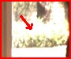
    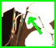 &emsp;
    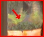
     &emsp;
    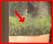
    
</p>

TODO: support selecting boxes in an interactive manner.


